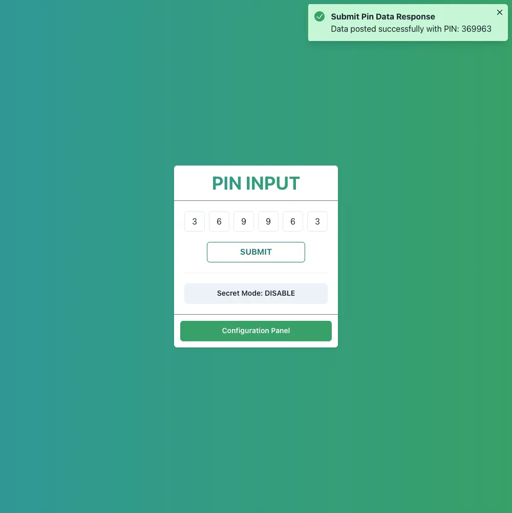

# Pin Input



- This project is a practice exercise to familiarize myself with Chakra UI, a flexible and accessible component library for React. It serves as a sandbox environment for experimenting with Chakra UI's features and styles.
- Live demo: https://minhtc-tech-pin-input.netlify.app/
- Please give this source a star, thank you so much 🥰.

## Installation

To run this project locally, follow these steps:

1. Clone the repository or download the source code.
2. Navigate to the project directory.
3. Install the dependencies using npm:

```shell
npm install
```

## Usage

To start the development server and view the Chakra UI practice project, use the following command:

```shell
npm start
```

This will start the development server and open the project in your default browser at `http://localhost:3000`.
